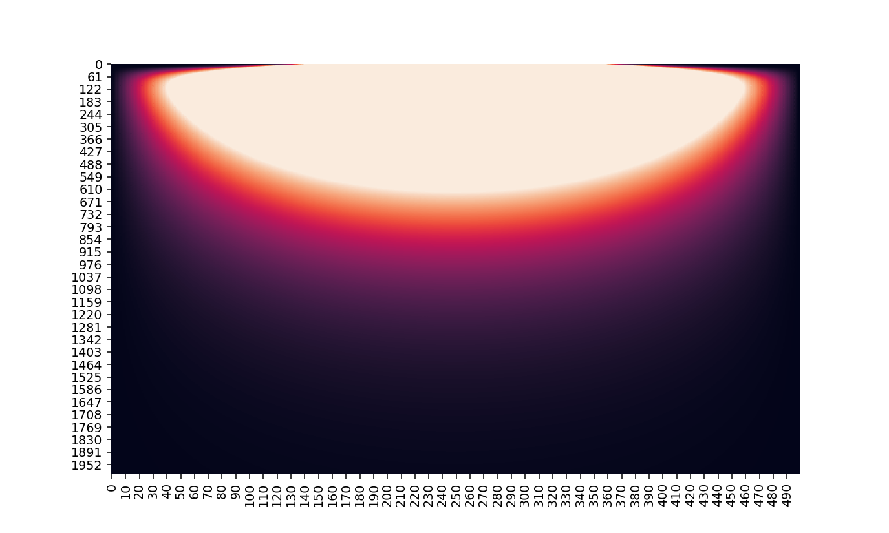

# Thermal Numerical Model
Euler method to solve nonlinear ODE, the diffusion/heat equation. Here is it solved for a one dimensional rod with time on the y axis:

For the 2D version, I implemented the reverse Euler technique to stably solve with fewer timesteps and more spacesteps. This is achieved by solving a large set of simultaneous equations using SciPy's linear algebra functionality. Also added a way to download each temperature grid as a seperate file then compile that data into a gif:

